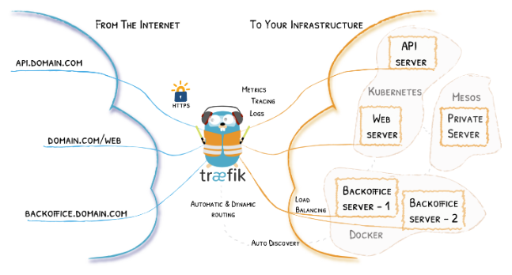

<!--more-->

## O que é Traefik

Traefik (pronuncia-se “traffic”) é um proxy reverso e balanceador de carga para microsserviços de código aberto. Traefik pode nos ajudar a subir serviços mais rapidamente sem barrar no excesso de configurações de infra e simplificar o ambiente. Ele é escrito em go e é super leve e rápido, como exemplo a imagem docker possui 43MB [imagem-latest](https://hub.docker.com/layers/library/traefik/latest/images/sha256-00cefa1183ba9d8972b24cca4f53f52cad38599ac01f225d11da004ac907c2db?context=explore).

Alguns recursos úteis que o Traefik nos disponibiliza:

- Auto Discovery
- Metrics
- SSL
- Dashboard
- Circuit breakers (LatencyAtQuantileMS, NetworkErrorRatio, ResponseCodeRatio)
- Rate Limit
- Retry (Enable retry sending request if network error)
- Sticky sessions
- Health Check
- Canary deployments (Kubernetes)
- Mirroring (Kubernetes)



## Instalando Traefik

### Pré-requisitos

Precisamos obviamente de um cluster Kubernetes, para nosso exemplo utilizaremos um cluster EKS na AWS, se você não sabe como criar um cluster na AWS pode dar uma olhada [nesse artigo](https://sidneiweber.com.br/como-criar-cluster-kubernetes-eks-na-aws-com-eksctl/) que escrevi. Também precisaremos de duas ferramentas instaladas:

- helm
- kubectl

Caso ainda não conheça o helm, sugiro dar uma lida nesse artigo da Red Hat: https://www.redhat.com/pt-br/topics/devops/what-is-helm

### Instalação do Traefik

Primeiro vamos criar um arquivo yaml onde iremos declarar alguns ajustes referentes ao traefik e que iremos utilizar durante a instalação. Editando o arquivo `traefik-values.yaml`:

```yaml
ingressClass:
  enabled: true
  isDefaultClass: true
  fallbackApiVersion: v1

ingressRoute:
  dashboard:
    enabled: false

service:
  annotations:
    service.beta.kubernetes.io/aws-load-balancer-type: nlb
globalArguments:
- "--api.insecure=true"
```

Bom o arquivo aqui é autodeclarativo, mas basicamente estamos dizendo para que durante a instalação seja criado o ingressClass do traefik no nosso cluster e o mesmo, seja utilizado como padrão. Também estamos desabilitando a rota para acessar o dashboard (configuraremos isso em outro post) e também estamos indicando que o tipo de balanceador de carga que iremos utilizar, e aqui será do tipo NLB (Network Load Balancer). Para mais detalhes sobe os valores disponíveis, podemos acessar o arquivo https://github.com/traefik/traefik-helm-chart/blob/master/traefik/values.yaml.

Com nosso arquivo em mãos podemos prosseguir adicionando o repositório helm do Traefik, seguido da atualização dos repositórios e a instalação do Traefik.

```shell
➜ helm repo add traefik https://helm.traefik.io/traefik
➜ helm repo update
➜ helm install traefik traefik/traefik --create-namespace --namespace=traefik --values=traefik-values.yaml
```

### Testando

Se nenhum erro ocorreu durante o processo já teremos o Traefik instalado e pronto para ser testado. Primeiramente vamos verificar os recursos criados durante a instalação em nosso cluster.

```shell
➜ kubectl get all -n traefik
NAME                           READY   STATUS    RESTARTS   AGE
pod/traefik-6b894fd4d7-m9b7k   1/1     Running   0          60s

NAME              TYPE           CLUSTER-IP      EXTERNAL-IP                                                                     PORT(S)                      AGE
service/traefik   LoadBalancer   10.100.235.23   a07cb2aa5c1384a14801dfee6b2dee7c-921b181b479547f4.elb.us-east-1.amazonaws.com   80:32181/TCP,443:32292/TCP   61s

NAME                      READY   UP-TO-DATE   AVAILABLE   AGE
deployment.apps/traefik   1/1     1            1           61s

NAME                                 DESIRED   CURRENT   READY   AGE
replicaset.apps/traefik-6b894fd4d7   1         1         1       61s
```

Podemos verificar que diversos recursos foram criados, mas gostaria de destacar o `service` criado e automaticamente associado a uma load balancer na AWS, conforme solicitamos no nosso arquivo `traefik-values.yaml`. É através desse load balancer que faremos todas as nossas requisições para o cluster.

Por desencargo de consciência vamos tentar o acesso ao endereço:

```shell
➜ curl a07cb2aa5c1384a14801dfee6b2dee7c-921b181b479547f4.elb.us-east-1.amazonaws.com
404 page not found
```

Ao acessar nosso endereço recebemos um erro 404, mas até aí tudo bem, esse é um erro esperado. Ainda não temos nenhum serviço dentro cluster e a resposta padrão do Traefik quando não encontra nenhum serviço é de fato retornar um erro 404.

Para termos certeza que tudo vai funcionar como esperado, vamos adicionar um serviço e associar a ele uma regra de acesso. Vamos criar o arquivo `2048.yaml`.

```yaml
apiVersion: apps/v1
kind: Deployment
metadata:
  name: deployment-2048
spec:
  selector:
    matchLabels:
      app: app-2048
  replicas: 1
  template:
    metadata:
      labels:
        app: app-2048
    spec:
      containers:
      - image: alexwhen/docker-2048
        imagePullPolicy: Always
        name: app-2048
        ports:
        - containerPort: 80

---
apiVersion: v1
kind: Service
metadata:
  name: service-2048
spec:
  ports:
    - port: 80
      targetPort: 80
      protocol: TCP
  type: NodePort
  selector:
    app: app-2048
---
apiVersion: traefik.containo.us/v1alpha1
kind: IngressRoute
metadata:
  name: 2048-ingress
  annotations:
    kubernetes.io/ingress.class: traefik
spec:
  entryPoints:
    - web
  routes:
    - match: PathPrefix(`/`)
      kind: Rule
      services:
        - name: service-2048
          port: 80
```

Para nosso exemplo vamos nos atentar principalmente ao último bloco do arquivo onde ficam as configurações específicas do Traefik. Configuramos aqui uma regra (Rule) onde os acessos ao cluster que acessem na rota principal (/), ou seja, o próprio endereço do cluster será redirecionado para o serviço que criamos. Essa regra poderia ser um path especifico assim como um endereço ou sub domínio, mais exemplos na [documentação](https://doc.traefik.io/traefik/routing/routers/).

Vamos conferir se o serviço subiu corretamente:

```shell
➜ kubectl get deploy                     
NAME              READY   UP-TO-DATE   AVAILABLE   AGE
deployment-2048   1/1     1            1           11m
```

Para garantir também vamos dar aquela conferida na nossa regra criada para o Traefik.

```shell
➜ kubectl get ingressroute
NAME           AGE
2048-ingress   11m

➜ kubectl describe ingressroute 2048-ingress 
Name:         2048-ingress
Namespace:    default
Labels:       <none>
Annotations:  kubernetes.io/ingress.class: traefik
API Version:  traefik.containo.us/v1alpha1
Kind:         IngressRoute
Metadata:
  Creation Timestamp:  2024-03-21T18:40:48Z
  Generation:          4
  Resource Version:    6036
  UID:                 31b125f9-b7e9-40ec-a367-352d8fc76de7
Spec:
  Entry Points:
    web
  Routes:
    Kind:   Rule
    Match:  PathPrefix(`/`)
    Services:
      Name:  service-2048
      Port:  80
Events:      <none>
```

Bom, então agora só nos falta o teste final, vamos tentar abrir o endereço do load balancer diretamente no navegador:


E pronto, aí está nosso serviço sendo exposto através do Traefik. Poderíamos deixar nosso Traefik mais parrudo, adicionando certificado, criando regras especificas, adicionando health check e outros recursos que o Traefik disponibiliza, mas vamos deixar para um próximo artigo.

Mas antes de irmos embora vamos criar um novo serviço e ver como a coisa fica muito simples e que realmente funciona. Vamos criar o arquivo `whoami.yaml` e seu conteúdo será muito parecido com o outro serviço, obviamente mudando a regra para acesso ao serviço.

```yaml
---
apiVersion: apps/v1
kind: Deployment
metadata:
  name: whoami
spec:
  replicas: 1
  selector:
    matchLabels:
      app: whoami
  template:
    metadata:
      labels:
        app: whoami
    spec:
      containers:
      - name: whoami
        image: traefik/whoami
---
apiVersion: v1
kind: Service
metadata:
  name: whoami
spec:
  ports:
  - name: http
    targetPort: 80
    port: 80
  selector:
    app: whoami
---
apiVersion: traefik.containo.us/v1alpha1
kind: IngressRoute
metadata:
  name: whoami-ingress
  annotations:
    kubernetes.io/ingress.class: traefik
spec:
  entryPoints:
    - web
  routes:
    - match: PathPrefix(`/whoami`)
      kind: Rule
      services:
        - name: whoami
          port: 80
```

E vamos criar os recursos:

```shell
kubectl apply -f whoami.yaml
```

Vamos direto conferir que nosso ingressRoute foi criado:

```shell
➜ kubectl get ingressroute
NAME             AGE
2048-ingress     23m
whoami-ingress   3m26s
```

Novamente vamos aos testes, agora cuidando para acessar pelo mesmo endereço e na rota `/whoami`.

```shell
➜ curl http://a07cb2aa5c1384a14801dfee6b2dee7c-921b181b479547f4.elb.us-east-1.amazonaws.com/whoami
Hostname: whoami-697f8c6cbc-4cbgp
IP: 127.0.0.1
IP: ::1
IP: 192.168.19.98
IP: fe80::7c11:eeff:fe2c:5156
RemoteAddr: 192.168.2.114:41940
GET /whoami HTTP/1.1
Host: a07cb2aa5c1384a14801dfee6b2dee7c-921b181b479547f4.elb.us-east-1.amazonaws.com
User-Agent: curl/7.88.1
Accept: */*
Accept-Encoding: gzip
X-Forwarded-For: 192.168.3.224
X-Forwarded-Host: a07cb2aa5c1384a14801dfee6b2dee7c-921b181b479547f4.elb.us-east-1.amazonaws.com
X-Forwarded-Port: 80
X-Forwarded-Proto: http
X-Forwarded-Server: traefik-6b894fd4d7-m9b7k
X-Real-Ip: 192.168.3.224
```


https://traefik.io/blog/eks-clusters-with-traefik-proxy-as-the-ingress-controller/