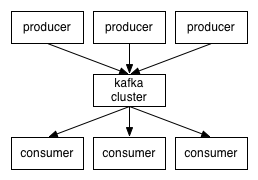
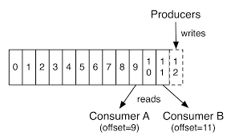

## O que é o Kafka

Resumidamente o Kafka é usado para trabalhar com fila de mensagens e como uma plataforma de streaming de eventos, usando um modelo de "publicar/assinar". Foi criado e disponibilizado pelo [Linkedin](https://github.com/linkedin/kafka) em 2011. Ele permite que os produtores consigam gravar mensagens no Kafka, que posteriormente podem ser lidas por um ou mais consumidores. Esses registros não podem ser modificados após serem enviados para o Kafka.
Ele é executado como um cluster de um ou mais servidores, ou seja, mesmo que só tenhamos um servidor ele mesmo assim é considerado um cluster. Cada nó desse cluster é também chamado de **broker**.

### Tópicos

Os registros são organizados em tópicos. Cada consumidor pode assinar um ou mais tópicos para ler os registros. Esses registros consistem em uma chave, um valor e data/hora. Cada tópico pode ser separado em várias partições dependendo do seu tamanho e configuração, por padrão só uma partição é utilizada, mas para escalar os consumidores o aumento de partições se faz necessária, pois cada partição é assinada por somente um consumidor por vez.

### Grupo de consumidores

Os consumidores são identificados com um nome de **grupo de consumidores**. Esse grupo pode ter mais de um consumidor em um tópico trabalhando juntos, desde haja mais de uma partição, sempre que uma nova mensagem é recebida, só um membro desse grupo consome essa mensagem.

### Offset
Uma questão bem importante para uso do Kafka é o entendimento dos **offsets**. O offset é quem controla a posição onde o consumidor parou de ler as mensagens ou qual a próxima mensagem. Esse controle é feito pelo próprio consumidor. Por exemplo, cada vez que um determinado consumidor ler uma mensagem, ele vai incrementando seu offset para saber exatamente onde ele parou e caso desconecte e conecte novamente, tenha um ponto de partida. O consumidor ainda pode ser configurado para iniciar seu offset, caso não tenha nenhum, da [primeira ou da última](https://kafka.apache.org/documentation/#auto.offset.reset) mensagem do tópico.

### Tempo de retenção
Um ponto que se deve ter bastante atenção em entender e configurar da maneira correta, para não termos dores de cabeça (experiência própria), é com o tempo de retenção dos dados. Vou citar aqui duas das principais configurações relativas à retenção, na [documentação](https://kafka.apache.org/documentation) podemos achar várias outras.
* **log.retention.hours:** Relativo a quantidade de horas para manter uma mensagem. Após o tempo determinado aqui a mensagem é excluída do servidor. Por padrão são 168 horas (7 dias).
* **offsets.retention.minutes:** Depois que um grupo de consumidor fica vazio, sem nenhum consumidor conectado, esse é o tempo que o offset do consumidor será mantido. Lembrando que se o offset é zerado o consumidor poderá consumir novamente as mensagens do tópico desde o início novamente, se aplicação não estiver preparada para validar se existe duplicação, pode ocorrer alguns problemas. Nas últimas versões o valor padrão é 10080 minutos (7 dias).

### Zookeeper
Outro componente essencial para a execução do Kafka é o Zookeeper. Ele apoia ajudando na eleição de qual broker será líder de determinada partição, controlando caso algum nó caia, para que outros possam assumir essa liderança. O Zookeeper também mantém uma lista de todos os nós que estão funcionando e fazer parte do cluster. Controle dos tópicos, quais tópicos existem, quantas partições cada um tem, onde estão as réplicas, quem é o líder. Realizado também controle de quotas e controle de acesso.

Existe um [movimento](https://www.confluent.io/blog/removing-zookeeper-dependency-in-kafka/) em andamento para retirar o Zookeper como uma dependência para executar o Kafka, deixando para o próprio Kafka se autogerenciar. Acredito que isso possa diminuir a complexidade da arquitetura Kafka/Zookeeper

### Conclusão

O Kafka se bem configurado e estruturado é uma ótima ferramenta para interligar serviços sem depender de uma conexão direta entre eles. Cada serviço manda e busca sua mensagem diretamente no Kafka tirando essa responsabilidade dos serviços. Como o Kafka já foi projetado para uma alta demanda, o crescimento em todos os aspectos é muito facilitado. 
Em outro texto vou mostrar como fazer uma configuração e instalação básica do Kafka e como podemos produzir e consumir algumas mensagens de maneira bem simples.

Documentação: [https://kafka.apache.org/documentation/](https://kafka.apache.org/documentation/)

[Understanding Kafka — A Distributed Streaming Platform](https://medium.com/swlh/understanding-kafka-a-distributed-streaming-platform-9a0360b99de8)