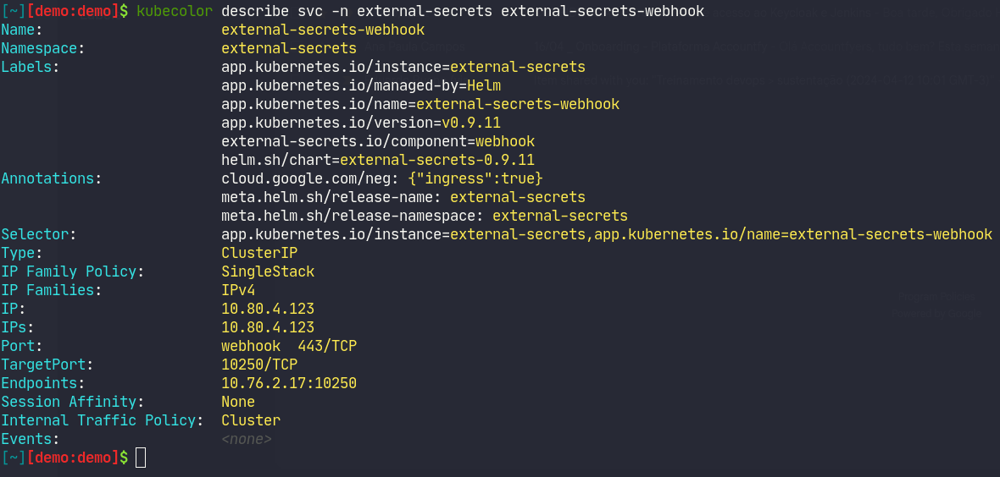
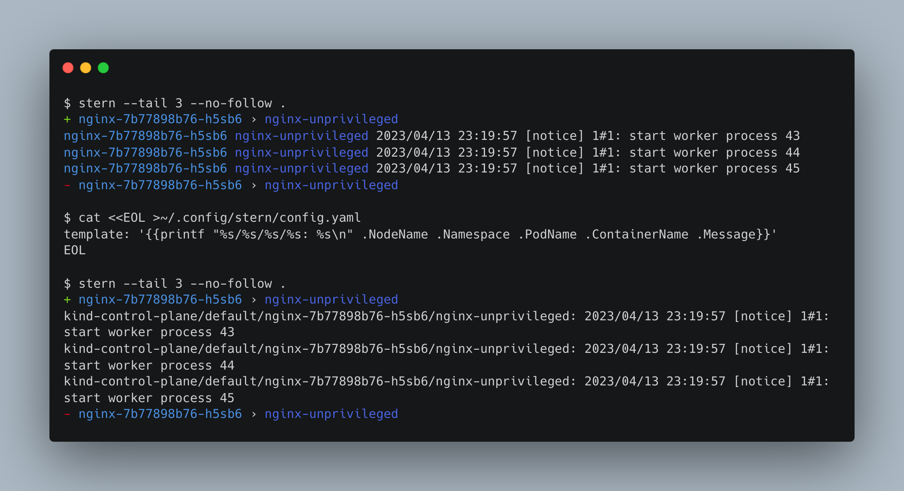
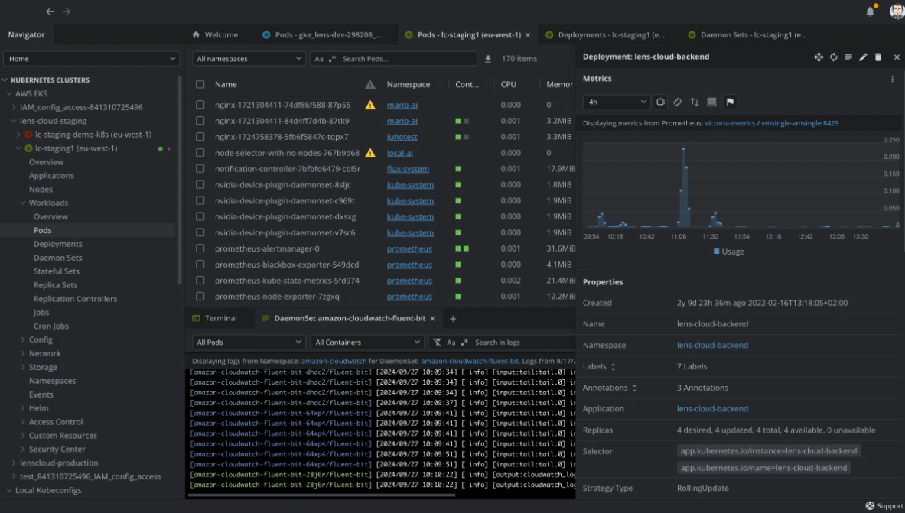
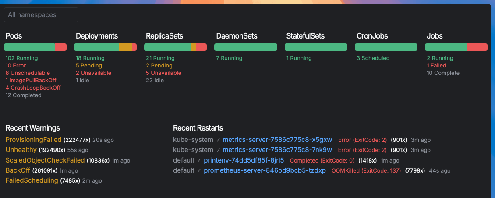
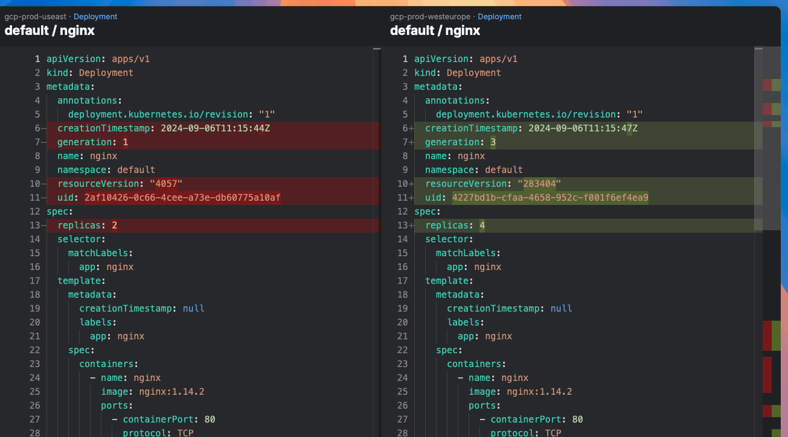

<!--more-->

Se você trabalha com Kubernetes no dia a dia, sabe que escolher as ferramentas certas pode te ajudar muito a otimizar o trabalho. Caso contrário gerenciar seu kubernetes pode virar uma dor de cabeça. Neste post, compartilho as ferramentas que uso diariamente para tornar a gestão de clusters Kubernetes mais produtiva, segura e eficiente.

## 🎨 kubecolor – Saídas do Kubectl com Cores

O kubecolor adiciona cores na saída do kubectl, tornando a leitura muito mais fácil. Campos importantes como status, nomes, namespaces e erros ficam destacados, agilizando a interpretação de informações no terminal. A ferramenta mantém a sintaxe padrão dos comandos kubectl.

### Instalação:
Instalação em um sistema Linux baseado em debian:

```shell
sudo apt-get update
sudo apt-get install apt-transport-https wget --yes
wget -O /tmp/kubecolor.deb https://kubecolor.github.io/packages/deb/pool/main/k/kubecolor/kubecolor_$(wget -q -O- https://kubecolor.github.io/packages/deb/version)_$(dpkg --print-architecture).deb
sudo dpkg -i /tmp/kubecolor.deb
sudo apt update
```

### Exemplo de utilização:
```shell
kubecolor get pods -n default
kubecolor describe svc meu-servico
kubecolor get nodes
```

### Imagens: 




## 🔄 kubectx – Gerenciando Contextos Facilmente

O kubectx permite alternar rapidamente entre diferentes contextos de clusters. Para quem trabalha com múltiplos clusters ou ambientes (dev, staging, produção), ele é uma mão na roda. Esqueça comandos longos para alterar contextos — com kubectx é questão de um simples comando.

### Exemplos
```shell
kubectx
kubectx nome-do-contexto
kubectx -
```


## 📦 kubens – Troca Rápida de Namespaces

Complementando o kubectx, o kubens permite alternar rapidamente entre namespaces dentro de um cluster Kubernetes. Ideal para quem lida com ambientes organizados por namespace, evitando esquecer o sempre esquecível --namespace.

### Exemplos
```shell
kubens
kubens nome-do-contexto
kubens -
```


## 📜 stern – Logs de Múltiplos Pods em Tempo Real

O stern facilita muito para acompanhar os logs dos pods. Ele tem suporte a filtros por namespace, labels ou padrões regex, ele agrupa logs coloridos em tempo real, facilitando muito o troubleshooting em aplicações distribuídas com múltiplas réplicas.

### Exemplos
Exemplo do comando para acompanhar os logs de todos os pods com nome que contém api:

```shell
stern api
```

Logs de um deployment específico em um namespace:

```shell
stern backend -n producao
```

Usar expressão regular para múltiplos pods:

```shell
stern "api|backend"
```

Filtrar por containers específicos dentro do pod:

```shell
stern api -c container1 -c container2
```



## 👁️ Lens – O Dashboard Completo para Kubernetes

O Lens é uma das melhores ferramentas gráficas para Kubernetes, ela oferece uma visão detalhada dos clusters, workloads, rede, storage e muito mais. Ela tem uma interface simples e intuitiva. Permite executar comandos, gerenciar recursos e monitorar clusters de forma visual e muito bem organizada.

Para baixar e instalar acesse https://k8slens.dev



## 🧠 Aptakube – Leve, Rápido e Multicluster

Agora vou falar de uma ferramenta que infelizmente não é free ou opensource, mas que me surpreendeu e muito pela simplicidade e eficiência. Mesmo sendo uma ferramenta paga para quem usa Kubernetes no dia a dia pode ser uma excelente ferramenta de trabalho.

O Aptakube tem uma ferramenta visualmente muito bonito e com recursos que torna a tudo mais simples. Suporta a conexão em múltiplos clusters ao mesmo tempo, visualização de logs eficiente, fácil entendimento dos recursos, além de um editor de YAML embutido muito parecido com vscode. Ah ainda é possível comparar arquivos yamls de clusters diferentes (muito prático).





Se achou interessante pode baixar e testar por 15 dias e usando meu link ainda pode ajudar essa pessoa que vos escreve https://aptakube.com/?ref=sidneiweber

## ⚙️ Plugins ZSH para Kubernetes – Terminal Turbo

Se você usa ZSH, há uma série de plugins também pode ajudar a tornar a experiência com Kubernetes muito mais produtiva:

* [kubectl autocomplete](https://gist.github.com/GusAntoniassi/2f58e716b67f648d13f91c1d780b05bf): Autocompleta recursos, comandos e namespaces.
* [kube-ps1](https://github.com/jonmosco/kube-ps1): Exibe o contexto e namespace atual diretamente no seu prompt, evitando comandos no cluster errado.

👉 Resultado no prompt:
```
[cluster:namespace] ➜
```
* [kubectl](https://github.com/ohmyzsh/ohmyzsh/tree/master/plugins/kubectl): Cria atalhos inteligentes para operações comuns.

## 💡 Conclusão

Essas ferramentas ajudam a transformar a gestão do Kubernetes em algo muito mais produtivo, intuitivo e seguro. Seja você um desenvolvedor, um SRE ou um DevOps, incorporar esses utilitários no seu dia a dia faz toda a diferença.