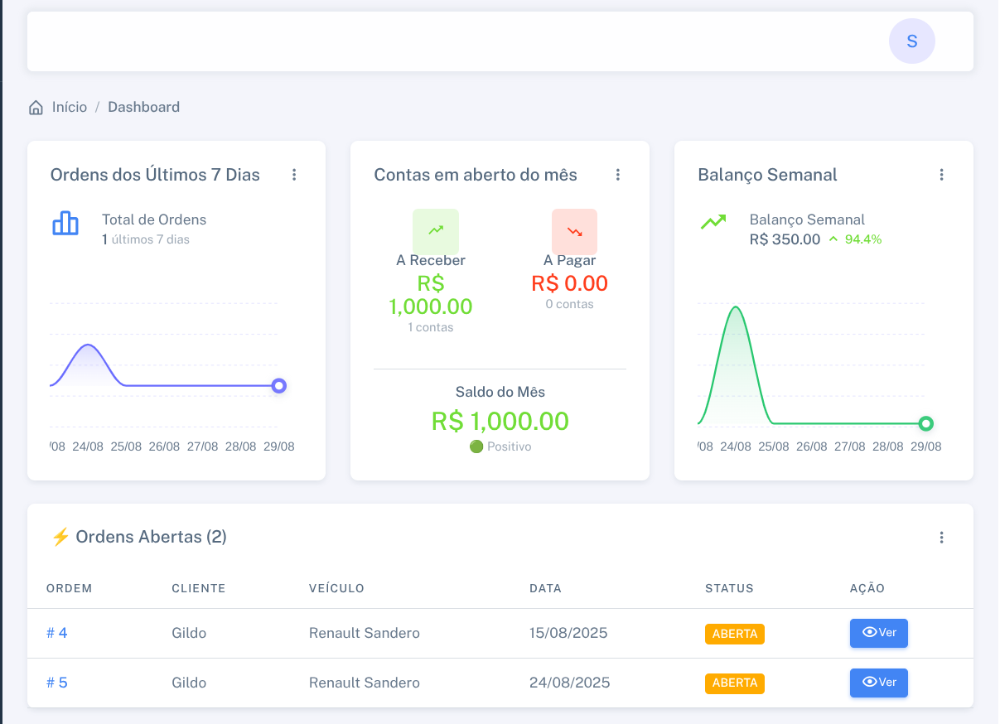

Sempre tentando trabalhar ou estudar algo novo e isso pode por ventura virar um projeto. Aqui listo alguns dos projetos nos quais trabalho ou trabalhei.

<table>
    <thead>
        <tr>
            <th>Logo</th>
            <th>Título</th>
            <th>Descrição</th>
            <th>Referências</th>
        </tr>
    </thead>
    <tbody>
        <tr>
            <td></td>
            <td>
              MecaniControl
              
              Active
              
            </td>
            <td>Software para gestão de oficinas mecânicas.</td>
            <td><a target="_blank" href="https://www.mecanicontrol.com.br">site</a></td>
        </tr>
         <tr>
            <td></td>
            <td>
              api-sorteador
            </td>
            <td>API criada com python e flask para estudos.</td>
            <td><a target="_blank" href="https://github.com/sidneiweber/api-sorteador">github</a></td>
        </tr>
         <tr>
            <td></td>
            <td>
              api-comments
            </td>
            <td>API criada para avaliação de um teste técnico. Possui toda a estrutura sendo criada na AWS através do terraform</td>
            <td><a target="_blank" href="https://github.com/sidneiweber/api-comments/blob/main/COMMENTS.md">estrutura</a> <a target="_blank" href="https://github.com/sidneiweber/api-comments/">github</a></td>
        </tr>
        <tr>
            <td></td>
            <td>
              Lista de compras
            </td>
            <td>Projeto com controle de estoque criado para testar o node</td>
            <td><a target="_blank" href="https://github.com/sidneiweber/lista-compras">github</a> </td>
        </tr>
        <tr>
            <td></td>
            <td>
              ansible-modules-documentdb
            </td>
            <td>Módulo ansible para criação de documentdb na AWS</td>
            <td><a target="_blank" href="https://github.com/sidneiweber/ansible-modules-documentdb">github</a> </td>
        </tr>
        <tr>
            <td></td>
            <td>
              ansible-modules-rds-cluster
            </td>
            <td>Módulo ansible para criação de cluster RDS na AWS</td>
            <td><a target="_blank" href="https://github.com/sidneiweber/ansible-modules-rds-cluster">github</a> </td>
        </tr>
        <tr>
            <td></td>
            <td>
              SCP Fácil
            </td>
            <td>Módulo ansible para criação de cluster RDS na AWS</td>
            <td><a target="_blank" href="https://github.com/sidneiweber/scpfacil">github</a> </td>
        </tr>
        <tr>
            <td></td>
            <td>
              vagrant-kafka-without-zookeeper
            </td>
            <td>Laboratório para utilizar kafka sem zookeeper utilizando Vagrant</td>
            <td><a target="_blank" href="https://github.com/sidneiweber/vagrant-kafka-without-zookeeper">github</a> </td>
        </tr>
        <tr>
            <td></td>
            <td>
              Emmi Linux (Parado)
            </td>
            <td>Projeto para criação de uma distribuição linux brasileira de fácil acesso</td>
            <td><a target="_blank" href="https://github.com/emmilinux">github</a> 
                <a target="_blank" href="https://x.com/emmi_os">twitter</a> 
                <a target="_blank" href="https://diolinux.com.br/sistemas-operacionais/conheca-o-emmi-linux-distro-linux.html">diolinux</a> 
                <a target="_blank" href="https://sempreupdate.com.br/emmi-linux-uma-distribuicao-gnu-linux-que-tem-tudo-para-ser-diferente">sempre update</a> 
                <a target="_blank" href="https://www.youtube.com/watch?v=rUNrFIn9gT8">Prof. Juliano Ramos</a> 
                <a target="_blank" href="https://www.youtube.com/playlist?list=PLA1mziqxFQkyJbaZi6kArJmMsnsyCZCdn">jaucity</a> 
            </td>
        </tr>
    </tbody>
</table>