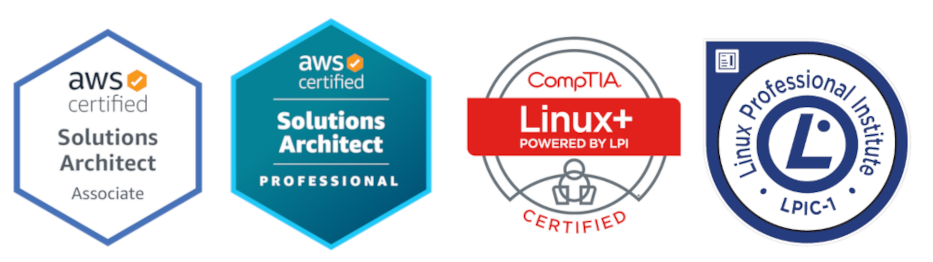

Olá eu sou **Sidnei Weber** :wave:.

Formado em Segurança da Informação, apaixonado por software livre, sempre buscando me aperfeiçoar e aprender novas tecnologias e tendências do mercado. Em busca de conhecimento (como diria o ET Bilu).

## Conhecimentos Técnicos
* Redes TCP/IP;
* Linguagem de programação: Shell Script, PHP, Python, NodeJs;
* Ferramentas CMS: Wordpress, Magento;
* Sistemas Operacionais: Linux, Windows;
* Escâneres de rede (NMAP);
* Controle de versão (GIT);
* Monitoramento de sistemas e serviços (Nagios/Zabbix);
* Containers (Docker);
* Gerenciador de configurações (Ansible), Scheduler Jobs (Rundeck)
* Segurança em servidores Linux;
* Firewall Iptables, Pfsense, Fortinet;
* Servidores de controle de acesso á internet (Proxy – Squid), servidor DHCP, servidor web
* Apache, servidor de mensagens instantâneas (Openfire), servidor de impressão (Cups), servidor de usuários e arquivos (LDAP/ Samba), servidor de acesso remoto (SSH/FTP), Banco de dados (MYSQL, Postgresql).
* Virtualização (VirtualBox, Vmware, Proxmox);
* Cloud (AWS, GCloud)

### Skills + usadas
* AWS
* Terraform
* Ansible
* Docker

### Linguagens + usadas
* Python
* Shell Script

## Certificações

## Cursos
> Tecnólogo em Segurança da Informação - UNIP (Concluído em 2022)